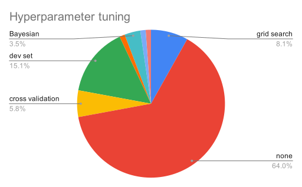
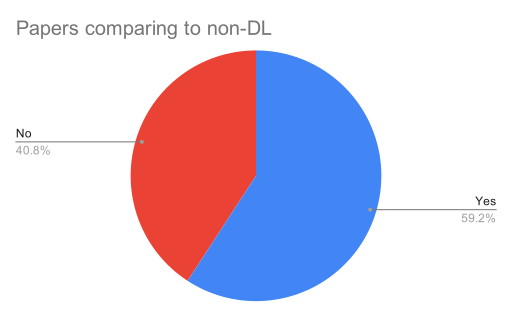
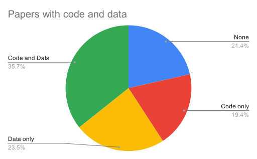
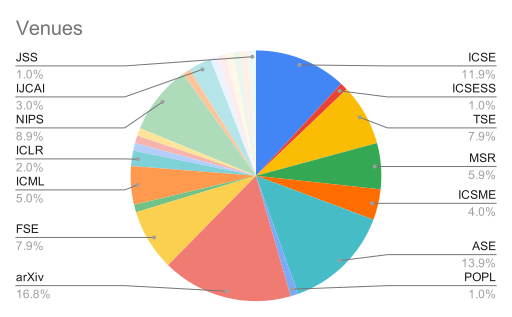
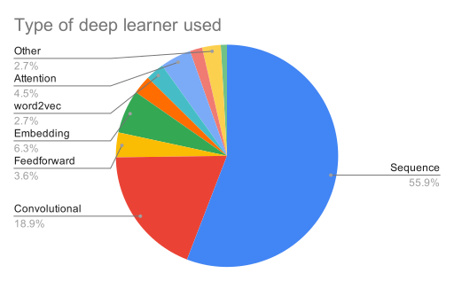
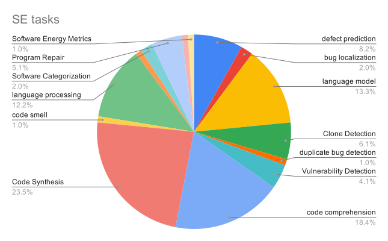

# DL4SE Literature Review Results

This is based on [98 papers](./DL4SE lit review.xlsx).

## Hyperparameter tuning

64% do no tuning at all.

## Comparing to non-DL

The majority (59.2%) do compare against non-DL, but most of these papers are in language processing or language modeling domains, where there were very few prior DL state of the art results in software engineering.

## Reproducibility

Only 35.7% of papers are fully reproducible. 23.5% are potentially reproducible (only data available), while 21.4% provide neither the code nor the data.

## Venues

There is a lot of variety in the venues published in. The top few (16.8%) are arXiv (many of these being very recently submitted (i.e., in 2020)), while ICSE (11.9%) and ASE (13.9%) have the next most number of papers. A fair number of papers (8.9%) are also in NeurIPS, a top machine learning conference. A very small number (2%) of papers are published in top venues in other domains, e.g. Principles of Programming Languages (POPL).

## DL Architectures

In collating this, several architectures were merged to prevent the prevalance of "special snowflake" architectures. Therefore, encoder-decoder and autoencoder models, along with language models, were combined into Sequence models; multi-layer perceptron models were combined into Feedforward networks. After doing this, it is clear that most of the work (55.9%) seems to use sequence models; this is partly due to the significant number of papers in language-related tasks.

## SE Tasks

We performed a similar aggregation here; tasks such as code search and API embedding for the purposes of translation to a different API were merged into code comprehension, while attempts to generate multi-task learners or embeddings for several tasks were merged into language models. NLP and programming language processing were merged into language processing.

Following this, the majority of the work is in code synthesis (23.5%) and code comprehension (18.4%), followed by language modeling (13.3%) and language processing (12.2%).

